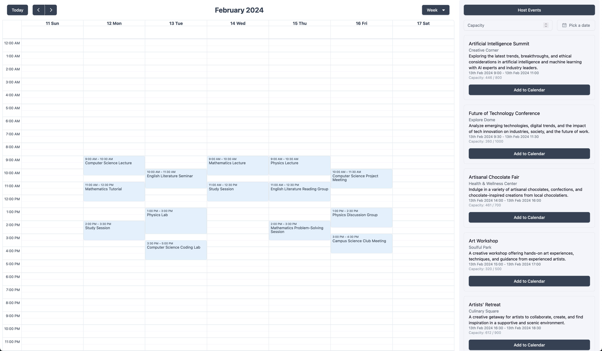
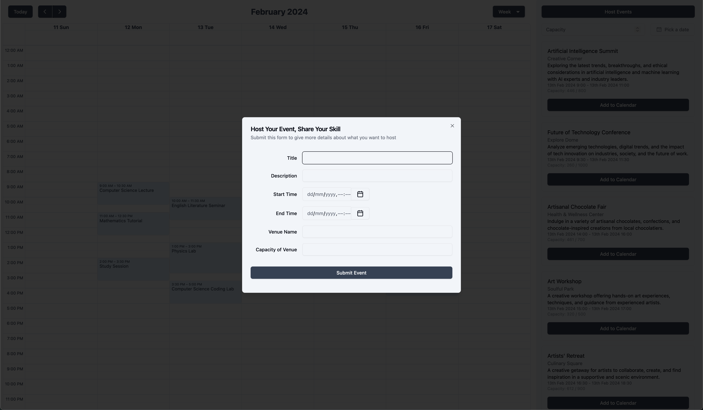
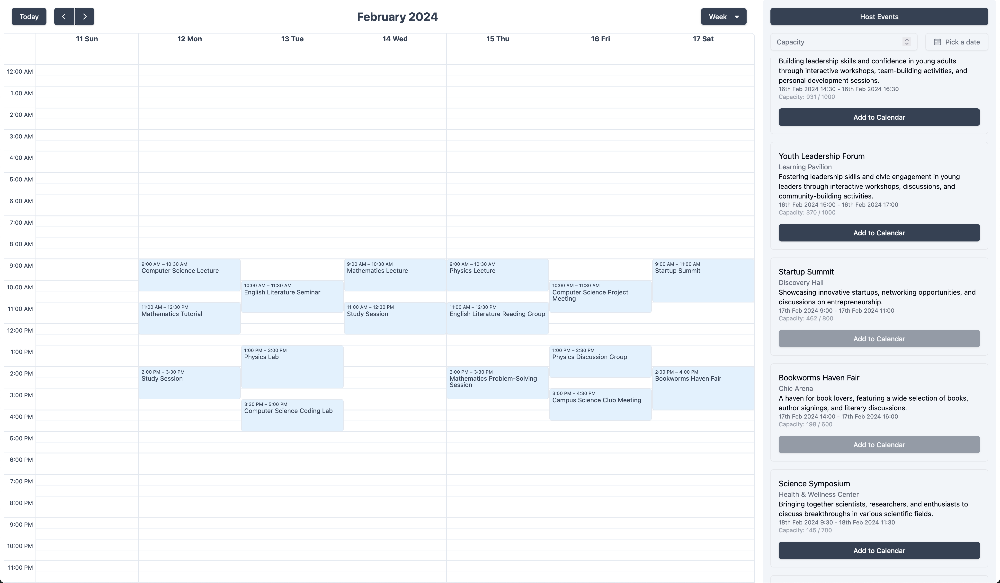

# IBM CIC Hackathon: Innovation Squad Member

UniSkill - Submission project for group 16, finished over the course of 3 days.
[Quick Link to The Worst Website Submission](https://github.com/AnselOngMJ/worst-website)

## Description

UniSkill is a revolutionary platform designed to enhance the university
experience by facilitating easy discovery and participation in skill-sharing
sessions, workshops, and informal learning groups. Our goal is to foster a
vibrant community where students can connect with peers sharing similar
interests, thereby promoting a culture of collaborative learning and personal
growth.

## Features

-   **Skill Sharing Sessions**: Enables users to find and join sessions where
    they can learn new skills or share their own.
-   **Workshop Organization**: Streamlines the process of organizing workshops,
    from planning to execution.
-   **Informal Learning Groups**: Facilitates the formation of informal learning
    groups for peer-to-peer education.
-   **Room Booking Integration**: Simplifies the booking of spaces for various
    activities.
-   **Event Scheduling**: Offers a comprehensive scheduling feature to
    accommodate the diverse timetables of university students.
-   **Safety and Transparency Features**: Implements security measures to ensure
    the safety and transparency of one-on-one and group events.

## Dependencies

Ensure you have these installed before proceeding.

-   NodeJS
-   Python
-   (Optional) Docker

## Installation & Usage

You can run this locally or run it with docker-compose

### Locally

-   Clone the repository:

```bash
git clone https://github.com/choco-green/my-uni-app.git
```

-   Run the frontend

```bash
cd my-uni-app/Frontend/
npm install
npm run dev
```

-   Run the backend

```bash
cd my-uni-app/Backend/
pip install -r ./requirements.txt
flask run
```

### Run with docker-compose

```bash
git clone https://github.com/choco-green/my-uni-app.git
cd my-uni-app
docker compose up
```

## Contributions:

-   [@AnselOngMJ](https://github.com/AnselOngMJ) - Python Backend (Flask)
-   [@choco_green](https://github.com/choco-green) - TS Frontend (React/Vite),
    Deployment (DigitalOcean)




