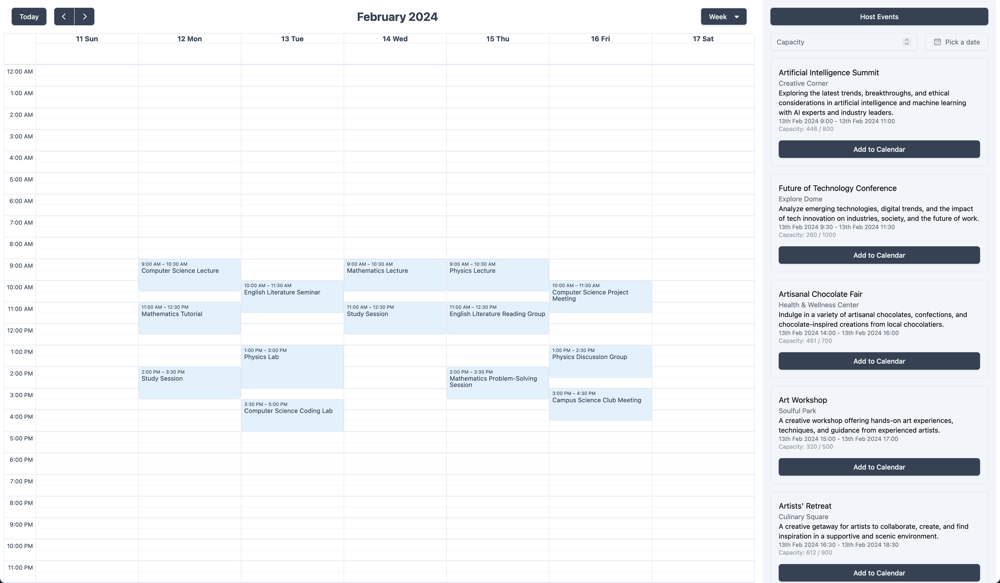

# 🏆 IBM CIC Hackathon Finalist — UniSkill

UniSkill is a student-focused platform designed to make peer-to-peer learning more accessible across university campuses.

Built in just 3 days during the IBM Client Innovation Centre (CIC) Hackathon, UniSkill enables students to discover, host, and participate in skill-sharing sessions, workshops, study groups, and community events. The platform aims to bridge the gap between students who want to learn new skills and those eager to share their knowledge, fostering a stronger culture of collaboration and continuous learning.

Our team was awarded Finalist Recognition for the project's innovation, technical implementation, and potential impact on student engagement.

## 🚀 Problem

Universities provide countless opportunities for learning beyond the classroom, yet students often struggle to:

- Discover peer-led workshops and learning opportunities
- Find students with complementary skills and interests
- Organise informal learning groups efficiently
- Manage event scheduling around busy academic timetables
- Secure suitable spaces for collaborative activities

UniSkill addresses these challenges by providing a centralised platform for organising and participating in student-led learning experiences.

## ✨ Features

### 📚 Skill Sharing Sessions
Discover and join peer-led sessions to learn new skills or teach others.

### 🎓 Workshop Management
Create, organise, and manage workshops from planning through execution.

### 👥 Learning Communities
Form study groups and informal learning circles around shared interests.

### 🏢 Room Booking Integration
Reserve spaces for workshops, study sessions, and events.

### 📅 Smart Event Scheduling
Coordinate events around university schedules with an intuitive calendar interface.

### 🔒 Safety & Transparency
Promote safer interactions through event visibility and participant transparency.

## 🛠️ Tech Stack

### Frontend
- React
- TypeScript
- Vite

### Backend
- Flask
- Python

### Deployment
- Docker
- DigitalOcean

## 👨‍💻 Team

- Ansel Ong — Backend Development (Flask)
- Justin Fung (@choco-green) — Frontend Development (React/TypeScript), Deployment & Infrastructure

## 🏅 Achievement

IBM CIC Innovation Hackathon – Finalist Award

Developed and presented as a proof-of-concept solution within a 3-day hackathon, demonstrating rapid prototyping, agile collaboration, and user-centred product desig
